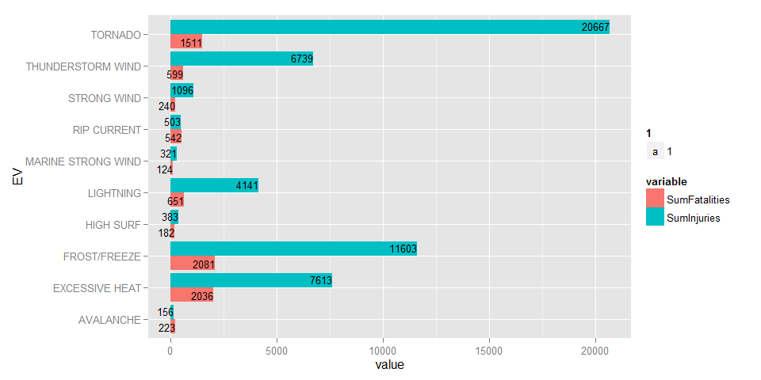
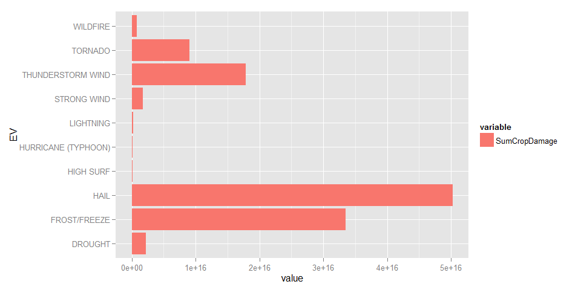
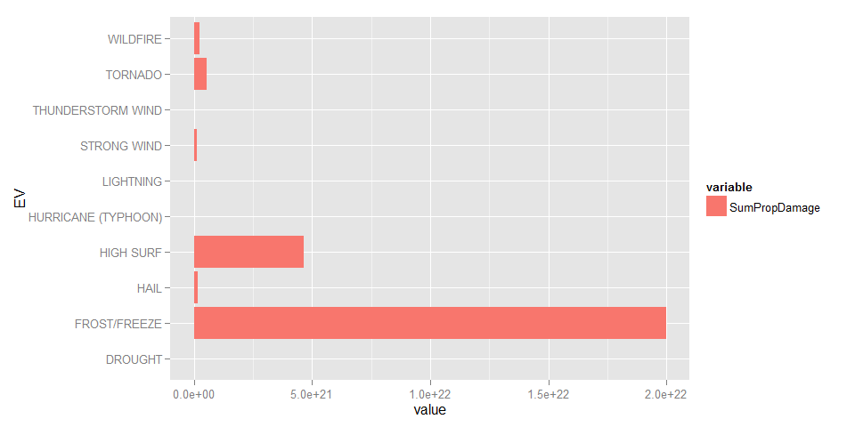

# NOAA Storm Database - Public Health and Economic Impact Analysis 
## Synopsis
This report aims to support governmental or municipal managers in making decisions on resource prioritization in the event of severe weather events like storms. On the one hand public health impact, i.e. casulties and injuries, are evaluated, on the other hand economic impact like property or crop damages are evaluated. The report is based on the NOAA Storm Database which is available from [NOAA Storm Database](http://www.ncdc.noaa.gov/stormevents/).
In the NOAA Storm Database Tornado are recorded from 1950 onwards. From 1955 to 1995 addtionally thunderstorm winds and hail events are  recorded and from 1996 the event types based on Directive 10-1605 are recorded.
For comparison purposes only the data which is based on Directive 10-1605 is considered.
The results show that most injuries are caused by Tornados and most casulties by Frost/Freeze and Excessive Heat. Most Crop Damages are casued by Hail. Most Property Damages are caused by Frost/Freeze.

## Requirements
Please make sure you have data.table, ggplot2 and dplyr package loaded

```r
library(data.table)
library(dplyr)
```

```
## 
## Attaching package: 'dplyr'
## 
## The following objects are masked from 'package:data.table':
## 
##     between, last
## 
## The following object is masked from 'package:stats':
## 
##     filter
## 
## The following objects are masked from 'package:base':
## 
##     intersect, setdiff, setequal, union
```

```r
library(ggplot2)
library(reshape2)
```

## Data Processing
Loading the file and create a dataset

```r
#       Download File
if(!file.exists('./Data/StormData.csv.bz2"')){
        download.file("http://d396qusza40orc.cloudfront.net/repdata%2Fdata%2FStormData.csv.bz2","./Data/StormData.csv.bz2")
}
#       Reading in a .bz2 file and create data table
storm <-  data.table(read.csv(bzfile("./Data/StormData.csv.bz2")))
```

In the next section the following processing steps are conducted:

1. Based on [Directive 10-1605](http://www.ncdc.noaa.gov/stormevents/pd01016005curr.pdf) the standard event types are summarized in order to align the storm dataset.

2. For both the public health and economic impact analysis only data from 1996 onwards is evaluated because the data before is limited to tornados respectively tornados, thunderstorm wind and hails.

3. Data records which do not include any fatalities or injuries or any damages are filtered out.

4. As some events are not coded according to standard they are coded manually.

5. The crop and property damage have an additional column which shows the exponent. This column is cleaned.

6. For both public health and damage a dataset is created.

```r
NOAAEvType <- toupper(c("Astronomical Low Tide","Avalanche","Blizzard","Coastal Flood","Cold/Wind Chill","Debris Flow","Dense Fog","Dense Smoke","Drought","Dust Devil","Dust Storm","Excessive Heat", "Extreme Cold/Wind Chill","Flash Flood","Flood","Frost/Freeze","Funnel loud","Freezing Fog","Hail","Heat","Heavy Rain","Heavy Snow","High Surf","High Wind","Hurricane (Typhoon)","Ice Storm","Lake-Effect Snow","Lakeshore Flood","Lightning", "Marine Hail","Marine High Wind","Marine Strong Wind","Marine Thunderstorm Wind","Rip Current","Seiche","Sleet", "Storm Surge/Tide","Strong Wind","Thunderstorm Wind","Tornado","Tropical Depression", "Tropical Storm","Tsunami","Volcanic Ash","Waterspout","Wildfire","Winter Storm","Winter Weather"))


#       Preapare Dataset for Analysis of Health Data
#       Creating Data Table by filtering out rows which have both fatalities and injuries <= 0
storm <- mutate(storm,BGN_DATE = as.POSIXct(BGN_DATE, format="%m/%d/%Y"))
stormDataHealth <- storm[(FATALITIES > 0 | INJURIES > 0) & year(BGN_DATE)>=1996,]
#       Creating index column
stormDataHealth[, index := seq_len(.N)]

#       Cleaning and Mapping of EVTYPE Column based on Directive 10-1605
for (i in stormDataHealth$index){
        stormDataHealth[i,EV := ifelse(any(agrepl(EVTYPE,as.character(NOAAEvType),ignore.case = TRUE)), 
                                           NOAAEvType[agrepl(EVTYPE,as.character(NOAAEvType),ignore.case = TRUE)],
                                           "NONE")]
}
stormDataHealth[grep("TSTM*",EVTYPE,ignore.case = TRUE),EV := "THUNDERSTORM WIND"]
stormDataHealth[grep("THUNDERSTORM*",EVTYPE,ignore.case = TRUE),EV := "THUNDERSTORM WIND"]
stormDataHealth[grep("STORM*",EVTYPE,ignore.case = TRUE),EV := "THUNDERSTORM WIND"]
stormDataHealth[grep("FIRE*",EVTYPE, ,ignore.case = TRUE),EV := "WILDFIRE"]
stormDataHealth[grep("*HEAT WAVE*",EVTYPE, ,ignore.case = TRUE),EV := "HEAT"]
stormDataHealth[grep("*WARM WEATHER*",EVTYPE, ,ignore.case = TRUE),EV := "HEAT"]
stormDataHealth[grep("*UNSEASONABLY WARM*",EVTYPE, ,ignore.case = TRUE),EV := "HEAT"]
stormDataHealth[grep("*WINTER WEATHER*",EVTYPE, ,ignore.case = TRUE),EV := "WINTER WEATHER"]
stormDataHealth[grep("*HAIL*",EVTYPE, ,ignore.case = TRUE),EV := "HAIL"]
stormDataHealth[grep("*FLD*",EVTYPE, ,ignore.case = TRUE),EV := "FLOOD"]
stormDataHealth[grep("*Flood*",EVTYPE, ,ignore.case = TRUE),EV := "FLOOD"]
stormDataHealth[grep("*ICY*",EVTYPE, ,ignore.case = TRUE),EV := "FROST/FREEZE"]
stormDataHealth[grep("*Glaze*",EVTYPE, ,ignore.case = TRUE),EV := "FROST/FREEZE"]
stormDataHealth[grep("*Cold*|LOW*|*FREEZING*|*SNOW*",EVTYPE, ,ignore.case = TRUE),EV := "FROST/FREEZE"]
stormDataHealth[grep("*EXTREME HEAT*",EVTYPE, ,ignore.case = TRUE),EV := "EXCESSIVE HEAT"]
stormDataHealth[grep("*RECORD HEAT*",EVTYPE, ,ignore.case = TRUE),EV := "EXCESSIVE HEAT"]
stormDataHealth[grep("*EXCESSIVE HEAT*",EVTYPE, ,ignore.case = TRUE),EV := "EXCESSIVE HEAT"]
stormDataHealth[grep("*TORNADO*",EVTYPE, ,ignore.case = TRUE),EV := "TORNADO"]
stormDataHealth[grep("*HEAVY SURF*|*HIGH SURF*",EVTYPE, ,ignore.case = TRUE),EV := "HIGH SURF"]
stormDataHealth[grep("*GUSTY WIND*",EVTYPE, ,ignore.case = TRUE),EV := "STRONG WIND"]
stormDataHealth[grep("*HIGH WIND*",EVTYPE, ,ignore.case = TRUE),EV := "STRONG WIND"]
stormDataHealth[grep("*SURF*",EVTYPE, ,ignore.case = TRUE),EV := "HIGH SURF"]
stormDataHealth[grep("*WINDCHILL*",EVTYPE, ,ignore.case = TRUE),EV := "EXTREME COLD/WIND CHILL"]
stormDataHealth[grep("*RAINFALL*",EVTYPE, ,ignore.case = TRUE),EV := "HEAVY RAIN"]
stormDataHealth[grep("*WIND STORM*",EVTYPE, ,ignore.case = TRUE),EV := "THUNDERSTORM WIND"]
stormDataHealth[grep("*SEAS*|*WAVE*",EVTYPE, ,ignore.case = TRUE),EV := "HIGH SURF"]
stormDataHealth[grep("*HIGH SWELLS*|*HIGH WATER*",EVTYPE, ,ignore.case = TRUE),EV := "HIGH SURF"]
stormDataHealth[grep("*RISING WATER*",EVTYPE, ,ignore.case = TRUE),EV := "COASTAL FLOOD"]

#       Creating sums for fatalities and injuries by EVTYPE and sorting in descending order
stormDataHealth <- stormDataHealth[,.(SumFatalities=sum(FATALITIES), SumInjuries = sum(INJURIES)),by=EV]
stormDataHealth <- arrange(stormDataHealth, desc(SumFatalities), desc(SumInjuries))

#       Preapare Dataset for Analysis of Economic Data
#       Creating Data Table by filtering out rows which have both property and crop damage <= 0
stormDataDamage <- storm[(PROPDMG>0|CROPDMG>0)& year(BGN_DATE)>=1996,]

#       Creating index column
stormDataDamage[, index := seq_len(.N)]

#       Cleaning and Mapping of EVTYPE Column based on Directive 10-1605
for (i in stormDataDamage$index){
        stormDataDamage[i,EV := ifelse(any(agrepl(EVTYPE,as.character(NOAAEvType),ignore.case = TRUE)), 
                                           NOAAEvType[agrepl(EVTYPE,as.character(NOAAEvType),ignore.case = TRUE)],
                                           "NONE")]
}
stormDataDamage[grep("TSTM*",EVTYPE,ignore.case = TRUE),EV := "THUNDERSTORM WIND"]
stormDataDamage[grep("THUNDERSTORM*",EVTYPE,ignore.case = TRUE),EV := "THUNDERSTORM WIND"]
stormDataDamage[grep("STORM*",EVTYPE,ignore.case = TRUE),EV := "THUNDERSTORM WIND"]
stormDataDamage[grep("FIRE*",EVTYPE, ,ignore.case = TRUE),EV := "WILDFIRE"]
stormDataDamage[grep("*HEAT WAVE*",EVTYPE, ,ignore.case = TRUE),EV := "HEAT"]
stormDataDamage[grep("*WARM WEATHER*",EVTYPE, ,ignore.case = TRUE),EV := "HEAT"]
stormDataDamage[grep("*UNSEASONABLY WARM*",EVTYPE, ,ignore.case = TRUE),EV := "HEAT"]
stormDataDamage[grep("*WINTER WEATHER*",EVTYPE, ,ignore.case = TRUE),EV := "WINTER WEATHER"]
stormDataDamage[grep("*HAIL*",EVTYPE, ,ignore.case = TRUE),EV := "HAIL"]
stormDataDamage[grep("*FLD*",EVTYPE, ,ignore.case = TRUE),EV := "FLOOD"]
stormDataDamage[grep("*Flood*",EVTYPE, ,ignore.case = TRUE),EV := "FLOOD"]
stormDataDamage[grep("*ICY*",EVTYPE, ,ignore.case = TRUE),EV := "FROST/FREEZE"]
stormDataDamage[grep("*Glaze*",EVTYPE, ,ignore.case = TRUE),EV := "FROST/FREEZE"]
stormDataDamage[grep("*Cold*|LOW*|*FREEZING*|*SNOW*",EVTYPE, ,ignore.case = TRUE),EV := "FROST/FREEZE"]
stormDataDamage[grep("*EXTREME HEAT*",EVTYPE, ,ignore.case = TRUE),EV := "EXCESSIVE HEAT"]
stormDataDamage[grep("*RECORD HEAT*",EVTYPE, ,ignore.case = TRUE),EV := "EXCESSIVE HEAT"]
stormDataDamage[grep("*EXCESSIVE HEAT*",EVTYPE, ,ignore.case = TRUE),EV := "EXCESSIVE HEAT"]
stormDataDamage[grep("*TORNADO*",EVTYPE, ,ignore.case = TRUE),EV := "TORNADO"]
stormDataDamage[grep("*HEAVY SURF*|*HIGH SURF*",EVTYPE, ,ignore.case = TRUE),EV := "HIGH SURF"]
stormDataDamage[grep("*GUSTY WIND*",EVTYPE, ,ignore.case = TRUE),EV := "STRONG WIND"]
stormDataDamage[grep("*HIGH WIND*",EVTYPE, ,ignore.case = TRUE),EV := "STRONG WIND"]
stormDataDamage[grep("*SURF*",EVTYPE, ,ignore.case = TRUE),EV := "HIGH SURF"]
stormDataDamage[grep("*WINDCHILL*",EVTYPE, ,ignore.case = TRUE),EV := "EXTREME COLD/WIND CHILL"]
stormDataDamage[grep("*RAINFALL*",EVTYPE, ,ignore.case = TRUE),EV := "HEAVY RAIN"]
stormDataDamage[grep("*WIND STORM*",EVTYPE, ,ignore.case = TRUE),EV := "THUNDERSTORM WIND"]
stormDataDamage[grep("*SEAS*|*WAVE*",EVTYPE, ,ignore.case = TRUE),EV := "HIGH SURF"]
stormDataDamage[grep("*HIGH SWELLS*|*HIGH WATER*",EVTYPE, ,ignore.case = TRUE),EV := "HIGH SURF"]
stormDataDamage[grep("*RISING WATER*",EVTYPE, ,ignore.case = TRUE),EV := "COASTAL FLOOD"]

#       Cleaning up Property and Crop Damage Exponent
#       Assumption that -,? and + values are 10^0 exponents.
stormDataDamage[PROPDMGEXP %in% c("-","?","+"),PROPDMGEXP := "0"]
stormDataDamage[PROPDMGEXP %in% c("B","b"),PROPDMGEXP := "9"]
stormDataDamage[PROPDMGEXP %in% c("M","M"),PROPDMGEXP := "6"]
stormDataDamage[PROPDMGEXP %in% c("H","h"),PROPDMGEXP := "5"]
stormDataDamage[PROPDMGEXP %in% c("K","k"),PROPDMGEXP := "3"]
stormDataDamage[,PROPDMGEXP := as.numeric(PROPDMGEXP)]
stormDataDamage[CROPDMGEXP %in% c("-","?","+"),CROPDMGEXP := "0"]
stormDataDamage[CROPDMGEXP %in% c("M","M"),CROPDMGEXP := "6"]
stormDataDamage[CROPDMGEXP %in% c("K","k"),CROPDMGEXP := "3"]
stormDataDamage[,CROPDMGEXP := as.numeric(CROPDMGEXP)]

#       Creating sums for property and crop sorting in descending order.
stormDataDamage <- stormDataDamage[,.(SumPropDamage=sum(10^PROPDMGEXP*PROPDMG),SumCropDamage=sum(10^CROPDMGEXP*CROPDMG)),by=EV]
stormDataDamage <- arrange(stormDataDamage, desc(SumPropDamage), desc(SumCropDamage))
```


## Results

###Top 10 Public Health Impact Severe Weather Events 
The following table and figure show the pulic health impact.

```r
stormDataHealth[1:10,]
```

```
##                     EV SumFatalities SumInjuries
##  1:       FROST/FREEZE          2081       11603
##  2:     EXCESSIVE HEAT          2036        7613
##  3:            TORNADO          1511       20667
##  4:          LIGHTNING           651        4141
##  5:  THUNDERSTORM WIND           599        6739
##  6:        RIP CURRENT           542         503
##  7:        STRONG WIND           240        1096
##  8:          AVALANCHE           223         156
##  9:          HIGH SURF           182         383
## 10: MARINE STRONG WIND           124         321
```

```r
stormDataHealth10 <- melt(stormDataHealth[1:10,],id="EV",measure.vars=c("SumFatalities","SumInjuries"))
qplot(x=EV, y=value, fill=variable,
                       data=stormDataHealth10, geom="bar", stat="identity",
                       position="dodge")  + geom_text(aes(x=EV, y=value, ymax=value, label=value, size=1,
                hjust=ifelse(sign(value)>0, 1, 0)), 
            position = position_dodge(width=1)) + coord_flip()
```

 


###Top 10 Crop Damage Severe Weather Events
The following table and figure show the crop damage.

```r
arrange(stormDataDamage[1:10,.(EV,SumCropDamage)],desc(SumCropDamage))
```

```
##                      EV SumCropDamage
##  1:                HAIL  5.025746e+16
##  2:        FROST/FREEZE  3.351099e+16
##  3:   THUNDERSTORM WIND  1.786792e+16
##  4:             TORNADO  8.995436e+15
##  5:             DROUGHT  2.218066e+15
##  6:         STRONG WIND  1.692299e+15
##  7:            WILDFIRE  8.194540e+14
##  8:           LIGHTNING  1.898940e+14
##  9:           HIGH SURF  9.116600e+13
## 10: HURRICANE (TYPHOON)  8.250000e+13
```


```r
stormCropDamage10 <- melt(arrange(stormDataDamage[1:10,.(EV,SumCropDamage)],desc(SumCropDamage)),id="EV",measure.vars=c("SumCropDamage"))
qplot(x=EV, y=value, fill=variable,
                       data=stormCropDamage10, geom="bar", stat="identity",
                       position="dodge")  +  coord_flip()
```

 


###Top 10 Property Damage Severe Weather Events 
The following table and figure show the property damage.

```r
stormDataDamage[1:10,.(EV,SumPropDamage)]
```

```
##                      EV SumPropDamage
##  1:        FROST/FREEZE  1.998501e+22
##  2:           HIGH SURF  4.656000e+21
##  3:             TORNADO  5.300019e+20
##  4:            WILDFIRE  2.540005e+20
##  5:                HAIL  1.800013e+20
##  6:         STRONG WIND  1.300004e+20
##  7:   THUNDERSTORM WIND  9.413385e+14
##  8:             DROUGHT  1.046101e+14
##  9:           LIGHTNING  7.430771e+13
## 10: HURRICANE (TYPHOON)  6.002300e+13
```


```r
stormPropDamage10 <- melt(stormDataDamage[1:10,],id="EV",measure.vars=c("SumPropDamage"))
qplot(x=EV, y=value, fill=variable,
                       data=stormPropDamage10, geom="bar", stat="identity",
                       position="dodge")  +  coord_flip()
```

 
